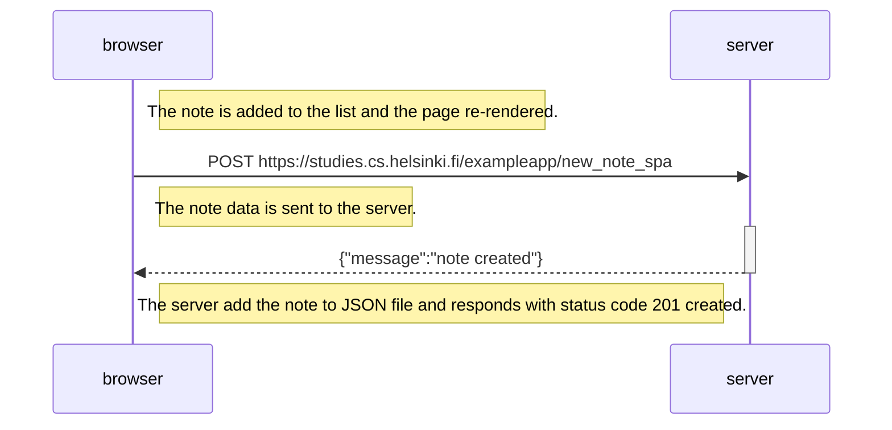

```mermaid

sequenceDiagram
    participant browser
    participant server

    Note right of browser: The note is added to the list and the page re-rendered.

    browser->>server: POST https://studies.cs.helsinki.fi/exampleapp/new_note_spa
    Note right of browser: The note  data is sent to the server.

    activate server
    server-->>browser: {"message":"note created"}
    deactivate server
    Note right of browser: The server add the note to JSON file and responds with status code 201 created.


```
